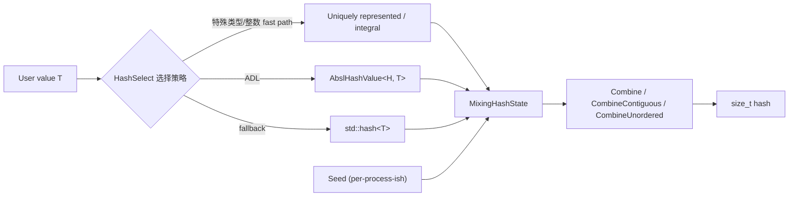

# absl::Hash 学习笔记（阶段三：设计与实现解析）

> 目标：理解框架如何选择 hash 路径、如何混合状态、做了哪些优化与取舍。

## 1) 总体架构（数据流）

你可以把 `absl::Hash<T>` 理解为：
1) 先选“如何把 T 转成 hash state 的熵”（HashSelect）
2) 再用统一的 mixing state 把熵混合成 `size_t`

## 2) 文件导航（File Map）

| 文件 | 职责 | 关键点 |
|---|---|---|
| `absl/hash/hash.h` | 对外 API + 教程 | `Hash<T>` 别名、`HashOf`、`HashState` type erasure |
| `absl/hash/internal/hash.h` | 主要实现 | `HashSelect`、`MixingHashState`、`PiecewiseCombiner`、seed 与优化路径 |
| `absl/hash/hash_test.cc` | 行为与边界测试 | piecewise hashing、`HashOf` 语义、type-erasure 示例 |
| `absl/hash/hash_testing.h` | 正确性验证工具 | 检查 `==` 与 hash expansion 的一致性（基于 gtest） |

## 3) 关键设计决策（Why）

### 3.1 抽象 hash 算法，避免用户依赖具体值
- 公开接口不暴露算法细节，允许升级混合函数而不改用户代码。
- 文档明确：不同进程/不同动态库可能产生不同 hash 值，因此禁止跨边界使用。

### 3.2 统一扩展点：`AbslHashValue` + ADL
- 让自定义类型只描述“把哪些字段纳入 hash state”。
- 通过 ADL 发现实现，避免集中注册表与侵入式修改。

### 3.3 引入 hash state 概念
- `H::combine(...)` 确保“逐次 combine 与可变参数 combine”一致（组合律约束）。
- `combine_unordered` 提供 order-independent hashing 支持无序容器。

## 4) HashSelect：如何决定走哪条路径（How）

实现位置：`absl/hash/internal/hash.h` 中的 `HashSelect`（约 `L1239` 起）。

选择顺序（从优先到后备）：
1. `WeaklyMixedInteger` 特殊路径（内部使用）
2. `is_uniquely_represented<T>`：允许按字节 hash（更快）
3. `AbslHashValue(state, value)`：用户自定义扩展点（ADL）
4. legacy hash（条件编译，兼容）
5. `std::hash<T>`：最终 fallback（兼容为主）

关键实现技巧：
- 使用探测（Probe）+ `absl::disjunction` 做“短路式选择”，避免不必要的模板实例化。

## 5) HashStateBase：CRTP 的公共 combine 逻辑

位置：`absl/hash/internal/hash.h` 前半部分 `HashStateBase`。

它定义了三个用户可见操作：
- `combine(state, values...)`
- `combine_contiguous(state, data, size)`
- `combine_unordered(state, begin, end)`

其中：
- `combine_contiguous` 允许内部使用更快的字节级/分块算法；因此不保证与逐元素循环完全一致。
- `combine_unordered` 通过回调/consumer 机制实现“按元素消耗熵并清空 inner state”，避免 heap 分配。

## 6) MixingHashState：默认混合状态与 seed

位置：`absl/hash/internal/hash.h` 的 `MixingHashState` 和 `Seed()`（约 `L1310+` 与 `L1420+`）。

关键点：
- `MixingHashState` 是 move-only：减少误用 moved-from state 的风险。
- 对小整数提供 **integral fast path**：避免在非优化编译下的模板膨胀和调用开销。
- `Seed()` 利用地址随机化（ASLR）等来源生成“非确定性 seed”，目标是阻止用户依赖固定 hash 值。
  - 注释也说明：当前 seed 的目的并非“密码学安全”，但为未来升级留下空间。

## 7) contiguous hashing 与 piecewise hashing 的优化

### 7.1 combine_contiguous 的多分支策略
`CombineContiguousImpl` 会按长度区间选择不同实现（小字符串、9–16、17–32、>32），在部分平台还使用 CRC32 指令路径（`ABSL_HASH_INTERNAL_HAS_CRC32`）。

### 7.2 PiecewiseCombiner：分块保证等价
位置：`PiecewiseCombiner`（`absl/hash/internal/hash.h` 早期）。
- 把大 buffer 按固定 chunk（默认 1024 bytes）拼接式地 hash，保证与“拼成一个连续 buffer 后一次 combine_contiguous”一致。
- 测试用例在 `absl/hash/hash_test.cc` 中有覆盖（piecewise buffer）。

## 8) 读后自检
- 你能否说清楚：`HashSelect` 为什么把 `AbslHashValue` 放在 `std::hash` 前？
- 你能否解释：为什么禁止跨 DSO 传递 hash 值？
- 你能否指出：`combine_contiguous` 为什么不要求与逐元素循环一致？
